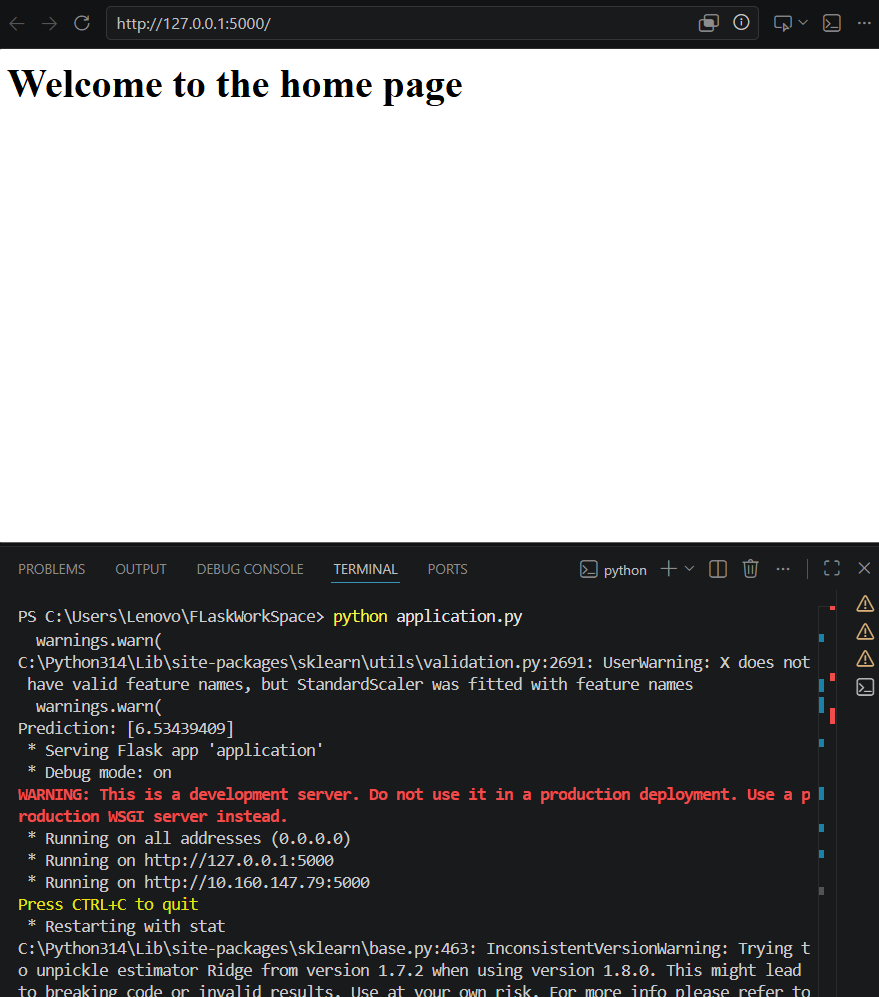
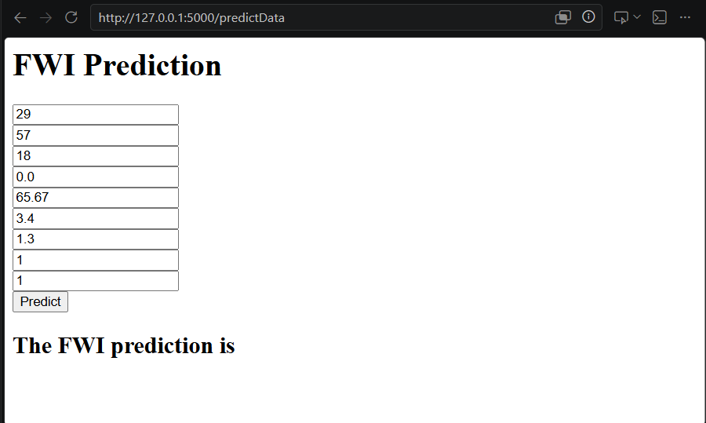
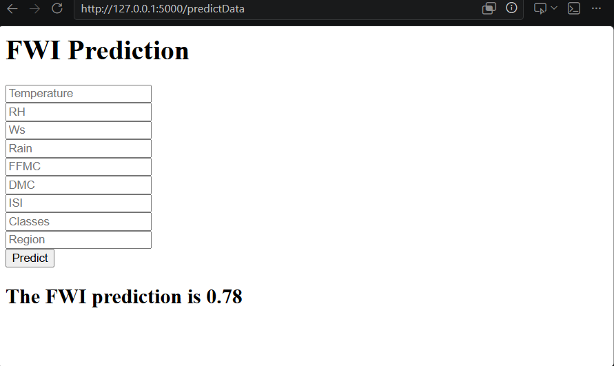

# Forest Fire Weather Index (FWI) Prediction

## Overview

This project is a Machine Learning web application that predicts the **Fire Weather Index (FWI)** based on environmental and weather-related parameters. The application is built using **Python, Flask, Scikit-learn, HTML, and CSS** and allows users to enter weather conditions through a web interface to obtain real-time FWI predictions.

## Features

* Predicts Fire Weather Index (FWI) using a trained Ridge Regression model.
* User-friendly web interface built with Flask.
* Data preprocessing using StandardScaler.
* Model serialized using Pickle.
* Easy deployment on cloud platforms such as Render, Railway, or AWS.

## Dataset Features

The model uses the following input parameters:

* Temperature (°C)
* Relative Humidity (RH)
* Wind Speed (Ws)
* Rain
* Fine Fuel Moisture Code (FFMC)
* Duff Moisture Code (DMC)
* Initial Spread Index (ISI)
* Classes
* Region

## Tech Stack

* Python
* Flask
* Scikit-learn
* NumPy
* Pandas
* HTML/CSS
* Pickle

## Project Structure

```text
Forest_Fire_Project/
│
├── application.py
├── requirements.txt
├── models/
│   ├── ridge.pkl
│   └── scaler.pkl
│
├── templates/
│   ├── index.html
│   └── home.html
│
├── notebooks/
│   └── Model Training.ipynb
│
└── README.md
```

## Installation

### Clone the Repository

```bash
git clone <repository-url>
cd Forest_Fire_Project
```

### Create a Virtual Environment

```bash
python -m venv venv
```

Activate the environment:

**Windows**

```bash
venv\Scripts\activate
```

**Linux/Mac**

```bash
source venv/bin/activate
```

### Install Dependencies

```bash
pip install -r requirements.txt
```

## Run the Application

```bash
python application.py
```

Open your browser and visit:

```text
http://127.0.0.1:5000/
```

## Machine Learning Workflow

1. Data Collection and Cleaning
2. Exploratory Data Analysis (EDA)
3. Feature Engineering
4. Data Scaling using StandardScaler
5. Model Training using Ridge Regression
6. Model Evaluation
7. Model Serialization with Pickle
8. Flask Deployment

## Example Prediction

Input weather parameters through the web interface and click **Predict**. The application will return the predicted Fire Weather Index value.

## Future Improvements

* Deploy the application to cloud platforms.
* Add multiple ML models for comparison.
* Improve UI/UX with Bootstrap.
* Add prediction history and analytics dashboard.

## Author

Developed as a Machine Learning and Flask deployment project for learning and demonstrating end-to-end ML application development.

## License

This project is open-source and available under the MIT License.
## Application Screenshot






